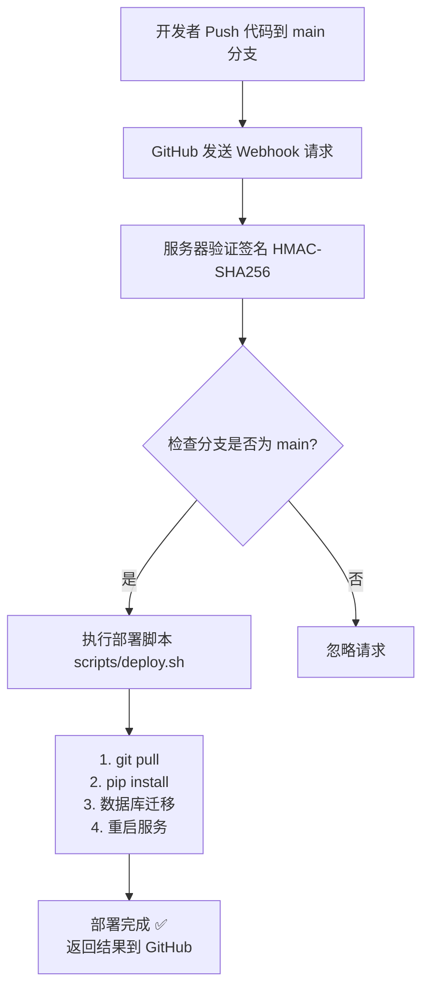

# 🔗 GitHub Webhook 自动部署配置指南

本项目支持通过 GitHub Webhook 实现安全的自动部署。当代码 push 到 `main` 分支时，GitHub 会通知你的服务器自动拉取更新并重启服务。

**相比 GitHub Actions 的优势**：
- ✅ **开源安全**：不会在公开仓库暴露服务器信息
- ✅ **服务器控制**：由服务器主动拉取，不需要配置 SSH 密钥到 GitHub
- ✅ **简单高效**：配置简单，无需复杂的 CI/CD 配置

---

## 📋 前置条件

1. 服务器已完成部署（运行过 `bash deploy.sh`）
2. 服务器配置了 systemd 服务
3. 服务器有公网 IP 或域名
4. GitHub 仓库有管理员权限

---

## 🚀 配置步骤

### 1️⃣ 配置服务器

#### 1.1 生成 Webhook Secret

在服务器上生成一个随机密钥：

```bash
# 生成随机 secret
openssl rand -hex 32
```

复制输出的随机字符串（例如：`a1b2c3d4e5f6...`）

#### 1.2 配置环境变量

编辑 `.env` 文件，添加 Webhook Secret：

```bash
cd ~/magic-conch
nano .env
```

添加或修改：

```bash
WEBHOOK_SECRET=你刚才生成的随机字符串
```

#### 1.3 配置 Sudo 权限

为了让 webhook 能够重启服务，需要配置 sudo 权限：

```bash
sudo visudo
```

添加以下内容（替换 `your_username` 为实际用户名）：

```sudoers
your_username ALL=(ALL) NOPASSWD: /bin/systemctl restart magic-conch
your_username ALL=(ALL) NOPASSWD: /bin/systemctl status magic-conch
your_username ALL=(ALL) NOPASSWD: /bin/systemctl is-active magic-conch
your_username ALL=(ALL) NOPASSWD: /bin/journalctl
```

或使用快捷脚本：

```bash
cd ~/magic-conch

# 创建 sudoers 配置
CURRENT_USER=$(whoami)
sudo tee "/etc/sudoers.d/magic-conch-$CURRENT_USER" > /dev/null << EOF
$CURRENT_USER ALL=(ALL) NOPASSWD: /bin/systemctl restart magic-conch
$CURRENT_USER ALL=(ALL) NOPASSWD: /bin/systemctl status magic-conch
$CURRENT_USER ALL=(ALL) NOPASSWD: /bin/systemctl is-active magic-conch
$CURRENT_USER ALL=(ALL) NOPASSWD: /bin/journalctl
EOF

sudo chmod 0440 "/etc/sudoers.d/magic-conch-$CURRENT_USER"
```

#### 1.4 重启服务

使新配置生效：

```bash
sudo systemctl restart magic-conch
```

### 2️⃣ 配置 GitHub Webhook

#### 2.1 进入仓库设置

1. 打开你的 GitHub 仓库
2. 点击 `Settings`（设置）
3. 左侧菜单选择 `Webhooks`
4. 点击 `Add webhook`（添加 webhook）

#### 2.2 填写 Webhook 配置

| 字段 | 值 | 说明 |
|------|-----|------|
| **Payload URL** | `https://conch.lesstk.com/api/webhook/deploy` | 服务器 Webhook 地址 |
| **Content type** | `application/json` | 必须选择 JSON 格式 |
| **Secret** | 粘贴之前生成的 Webhook Secret | 与 `.env` 中的 `WEBHOOK_SECRET` 一致 |
| **Which events** | 选择 `Just the push event` | 只监听 push 事件 |
| **Active** | ✅ 勾选 | 启用 webhook |

点击 `Add webhook` 保存。

#### 2.3 测试 Webhook

保存后，GitHub 会立即发送一个 ping 请求测试连接。

查看 webhook 配置页面底部：
- ✅ **绿色勾号**：表示连接成功
- ❌ **红色叉号**：表示连接失败，检查服务器配置

---

## 🧪 测试部署

### 方式一：手动触发

在 GitHub Webhook 配置页面，点击 webhook → `Recent Deliveries` → 选择一条记录 → 点击 `Redeliver`

### 方式二：提交代码

```bash
# 本地修改代码后提交
git add .
git commit -m "test: trigger webhook deployment"
git push origin main
```

推送后，服务器会自动：
1. 拉取最新代码
2. 更新依赖
3. 运行数据库迁移
4. 重启服务

### 查看部署日志

```bash
# 查看服务日志
sudo journalctl -u magic-conch -f

# 查看最近的部署日志
sudo journalctl -u magic-conch -n 100 --no-pager
```

---

## 🔍 故障排查

### Webhook 连接失败

**症状**：GitHub 显示红色 ❌

**检查清单**：

1. **防火墙配置**
   ```bash
   # 开放 8000 端口
   sudo ufw allow 8000
   sudo ufw status
   ```

2. **服务是否运行**
   ```bash
   sudo systemctl status magic-conch
   curl http://localhost:8000/health
   ```

3. **域名解析**（如果使用域名）
   ```bash
   ping your-domain.com
   ```

4. **Nginx/Caddy 反向代理**（如果使用）
   - 确保配置了正确的路径转发
   - 检查是否拦截了 webhook 请求

### Webhook 签名验证失败

**症状**：GitHub 显示 403 Forbidden

**解决方案**：

1. 检查 `.env` 中的 `WEBHOOK_SECRET` 是否配置正确
2. 确认 GitHub Webhook Secret 与服务器配置一致
3. 重启服务使配置生效：
   ```bash
   sudo systemctl restart magic-conch
   ```

### 部署脚本执行失败

**症状**：Webhook 返回成功，但服务未更新

**检查清单**：

1. **查看部署日志**
   ```bash
   sudo journalctl -u magic-conch -n 50
   ```

2. **检查脚本权限**
   ```bash
   ls -la scripts/deploy.sh
   # 应该显示 -rwxr-xr-x（可执行）
   ```

3. **手动测试脚本**
   ```bash
   cd ~/magic-conch
   bash scripts/deploy.sh
   ```

4. **检查 Git 权限**
   ```bash
   # 确保可以拉取代码
   git pull origin main
   ```

5. **检查 Sudo 权限**
   ```bash
   # 测试 sudo 是否需要密码
   sudo systemctl restart magic-conch
   ```

### 服务重启失败

**症状**：部署执行成功，但服务未重启

**解决方案**：

1. **查看详细错误**
   ```bash
   sudo systemctl status magic-conch -l
   ```

2. **检查配置文件**
   ```bash
   cat /etc/systemd/system/magic-conch.service
   ```

3. **重新加载 systemd**
   ```bash
   sudo systemctl daemon-reload
   sudo systemctl restart magic-conch
   ```

---

## 🔒 安全建议

### 1. 使用 HTTPS

生产环境建议配置 SSL 证书，使用 HTTPS：

```text
https://conch.lesstk.com/api/webhook/deploy
```

**推荐工具**：
- [Let's Encrypt](https://letsencrypt.org/) - 免费 SSL 证书
- [Caddy](https://caddyserver.com/) - 自动 HTTPS 反向代理
- [Nginx](https://nginx.org/) + Certbot

### 2. IP 白名单（可选）

只允许 GitHub IP 访问 webhook 端点：

**GitHub Webhook IP 范围**：<https://api.github.com/meta>

**Nginx 配置示例**：
```nginx
location /api/webhook/deploy {
    allow 192.30.252.0/22;
    allow 185.199.108.0/22;
    allow 140.82.112.0/20;
    deny all;
    proxy_pass http://localhost:8000;
}
```

### 3. 签名验证

**强烈建议**配置 `WEBHOOK_SECRET`，确保请求来自 GitHub：

```bash
# .env
WEBHOOK_SECRET=你的随机密钥（至少32位）
```

### 4. 限制分支

Webhook 默认只处理 `main` 分支的 push 事件，其他分支会被忽略。

如需修改，编辑 `server/app.py`：

```python
# 检查分支
ref = payload.get('ref', '')
if ref != 'refs/heads/main':  # 修改这里
    return {"ok": True, "message": f"Ignored: not main branch"}
```

### 5. 部署通知（可选）

在 `scripts/deploy.sh` 中添加通知功能：

```bash
# 钉钉通知
curl 'https://oapi.dingtalk.com/robot/send?access_token=xxx' \
  -H 'Content-Type: application/json' \
  -d '{"msgtype": "text", "text": {"content": "部署成功！"}}'

# Slack 通知
curl -X POST -H 'Content-type: application/json' \
  --data '{"text":"部署成功！"}' \
  YOUR_SLACK_WEBHOOK_URL
```

---

## 📊 监控部署

### 实时监控

```bash
# 实时查看服务日志
sudo journalctl -u magic-conch -f

# 实时查看部署触发（配合 webhook）
tail -f /var/log/syslog | grep webhook
```

### GitHub Webhook 历史

在 GitHub Webhook 设置页面 → `Recent Deliveries`：
- 查看每次请求的详细内容
- 查看服务器返回的响应
- 重新发送失败的请求

---

## 🎯 完整部署流程图



---

## 📞 获取帮助

- GitHub Webhooks 文档: <https://docs.github.com/webhooks>
- 项目 Issues: <https://github.com/xlryan/magic-conch/issues>

---

**🎉 配置完成后，每次 push 到 main 都会自动部署！**
